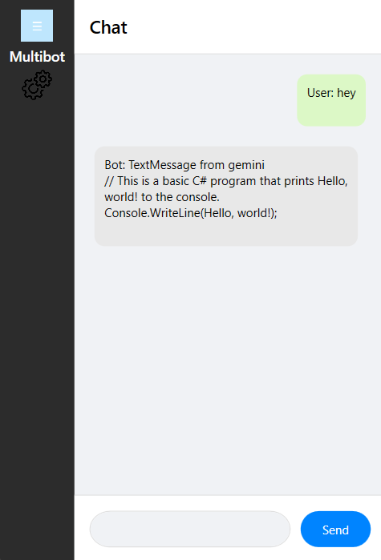

# Multibot

## Overview
Multibot is a powerful AI-driven chatbot framework that integrates multiple AI models to provide intelligent and dynamic responses. It allows seamless interaction with different AI models, making it adaptable for various use cases such as customer support, knowledge retrieval, and interactive conversations.

<p align="center">
  
</p>

---
## Features
- **Multi-AI Integration**: Supports multiple AI models for generating responses.
- **Markdown Rendering**: Displays formatted responses with markdown support.
- **Customizable UI**: Easily adaptable to different UI frameworks.
- **Real-time Interaction**: Processes and delivers instant responses.
- **Scalability**: Can be expanded to include additional AI integrations.

## Installation
### Prerequisites
Ensure you have the following installed:
- .NET 6.0 or later
- NuGet package manager
- Dependencies: `Markdig`, `AutoGen.Core`

### Steps
1. Clone the repository:
   ```sh
   git clone https://github.com/helloitsmeabhi/multibot.git
   cd multibot
   ```
2. Install dependencies:
   ```sh
   dotnet restore
   ```
3. Run the application:
   ```sh
   dotnet run
   ```

## Usage
### Sending a Message
```csharp
var response = await geminiAgent.SendAsync(userMessage);
AddMessageToChat("Bot", response);
```

### Rendering Markdown Messages
The application uses `Markdig` to render Markdown-formatted messages.
```csharp
using Markdig;
var markdown = Markdown.ToHtml(userMessage);
```

### UI Customization
Modify `AddMessageToChat` method to change message appearance.


